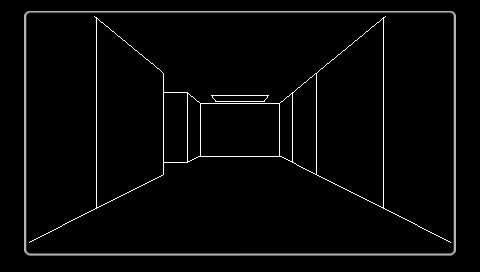
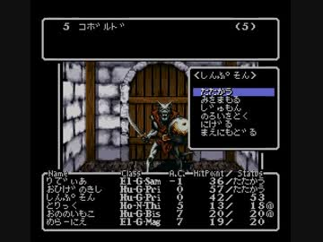
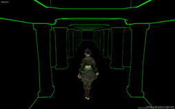

# eligrim

```
012
345
678
-*-

let trick=0,key=""
function draw(){
 requestAnimationFrame(draw)
 trick++;
 if(trick%10===0) key="" //keyflash
}
```

```
top message 3
right select 6+1
bottom status 6
```
     


```
trickcount green
stroke green to deepgreen
```
